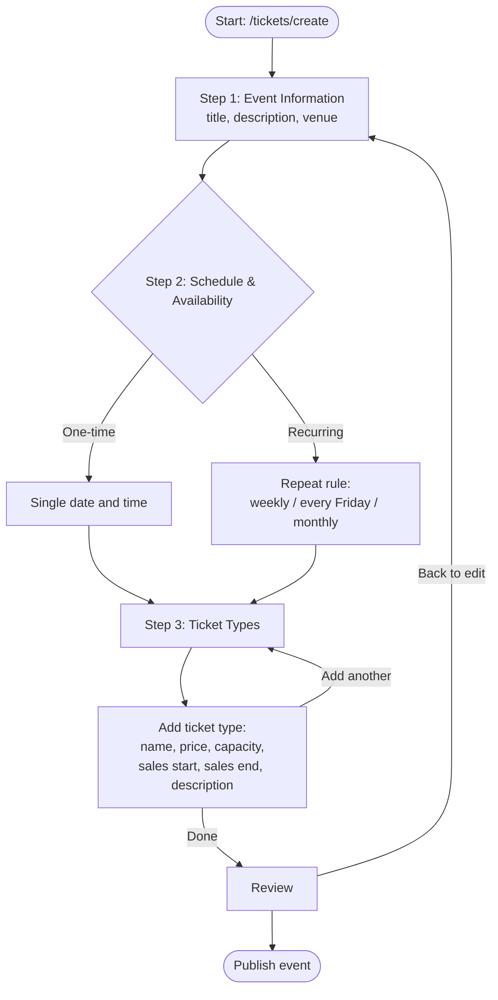

# Information Architecture

This document describes the surfaces of the Gishe platform: what exists today
(the public landing page and the ticket-creation wizard) and the anticipated
future dashboard. All UI is Persian and renders right-to-left.

## Surface overview

| Surface | Audience | Status |
| --- | --- | --- |
| Public marketing (landing) | Prospective organizers | Now |
| Ticket-creation wizard | Organizers | Now |
| Public event page + checkout | Attendees | Vision |
| Organizer dashboard | Organizers and staff | Vision |

## Route tree

```
/                         Public landing page (marketing)
  header                    Brand, primary nav, call to action
  hero                      Value proposition + primary CTA
  (sections)                Features, segments, social proof
  footer                    Secondary nav, legal, contact

/tickets/create           Ticket-creation wizard (3 steps)
  step 1                    Event Information
  step 2                    Schedule & Availability
  step 3                    Ticket Types

--- Anticipated future route groups (Vision) ---

/dashboard                Organizer home (overview)
/dashboard/events         Event Management (list, create, templates, venues)
/dashboard/tickets        Ticketing (types, categories, discount codes, pricing)
/dashboard/contacts       CRM (attendee profiles, notes, tags, segments, orgs)
/dashboard/marketing      Campaigns (SMS/email), referrals, promos, landing pages
/dashboard/operations     QR check-in, gate scanning, staff, entry permissions
/dashboard/analytics      Revenue, sales, attendance, funnel, marketing performance
/dashboard/finance        Payments, refunds, settlement, financial dashboard
/dashboard/settings       Organization, team, roles, billing

/e/[slug]                 Public event page (Vision)
/e/[slug]/checkout        Attendee checkout (Vision)
```

The `/dashboard/*` groups are directional, not committed. They exist here so the
current work stays consistent with where the product is heading.

## Public surface (Now)

The landing page is the marketing front door for prospective organizers. It is
composed of three structural regions:

- **Header** - brand mark (گیشه), primary navigation, and a primary call to
  action that leads organizers toward getting started.
- **Hero** - the core value proposition ("professional event management and
  ticketing for organizations") with the primary CTA and supporting motion.
- **Footer** - secondary navigation, legal links, and contact details.

The landing page sells the platform. It is not a catalog of events.

## Ticket-creation wizard (Now)

Route: `/tickets/create`. A focused, three-step flow that takes an organizer
from a blank slate to a published event with saleable tickets. The wizard is the
concrete expression of the "clarity over configuration" principle: a short,
guided path with progressive disclosure.

### Step 1 - Event Information (اطلاعات رویداد)

Captures the identity of the event.

| Field | Persian label | Notes |
| --- | --- | --- |
| Title | عنوان رویداد | Required, single line |
| Description | توضیحات | Optional, multi-line |
| Venue | محل برگزاری | Location of the event |

### Step 2 - Schedule & Availability (زمان‌بندی و برگزاری)

Captures when the event happens. Two mutually exclusive modes:

- **One-time (یک‌باره)** - a single date and time.
- **Recurring (تکرارشونده)** - a repeat rule, for example every Friday
  (هر جمعه), weekly (هفتگی), or monthly (ماهانه).

The chosen mode determines which controls are shown (single date/time picker
versus recurrence rule builder).

### Step 3 - Ticket Types (انواع بلیت)

Defines what is sold. The organizer can add an unlimited number of ticket types.
Each type has:

| Field | Persian label | Notes |
| --- | --- | --- |
| Name | نام بلیت | Required, e.g. عمومی / وی‌آی‌پی / دانشجویی |
| Price | قیمت | Amount in Toman; supports free (zero) |
| Capacity | ظرفیت | Maximum sellable count |
| Sales start | شروع فروش | When the type becomes buyable |
| Sales end | پایان فروش | When sales close |
| Description | توضیحات | Optional, per-type detail |

Example ticket types: General (عمومی), VIP (وی‌آی‌پی), Student (دانشجویی),
Early Bird (پیش‌فروش), Backstage (پشت‌صحنه).

### Wizard flow



## Future dashboard (Vision)

Once the wizard and public event page are live, the platform grows into a full
organizer dashboard. The route groups above map one-to-one to the capability
areas in `product-vision.md`: Event Management, Ticketing, CRM, Marketing,
Operations, Analytics, and Finance. The dashboard is the daily workspace where
the organizer manages the audience the wizard and checkout help them acquire.
