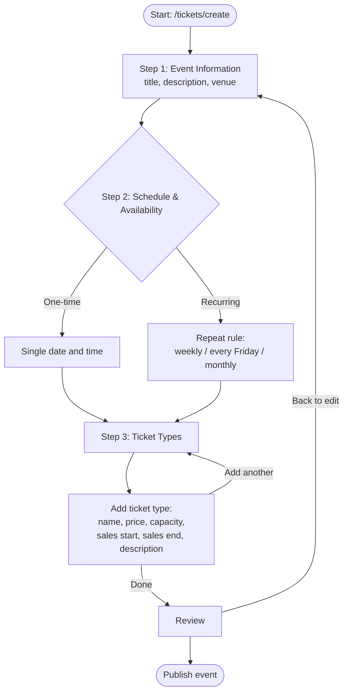

# Information Architecture

This document describes the surfaces of the Poster platform and their status.

## Surface overview

| Surface | Audience | Status |
| --- | --- | --- |
| Explore + public event pages | Attendees | Now |
| Checkout, incl. assigned seating | Attendees | Now |
| Attendee account (tickets, feed, orders) | Attendees | Now |
| Public marketing (`/hosts`) | Prospective organizers | Now |
| Ticket-creation wizard | Organizers | Now |
| Organizer dashboard | Organizers and staff | Now |
| Venue designer (`/admin`) | Internal staff | Now |

## Route tree

```
/                         Redirects to /events — the front door is explore
/events                   Explore: browse and filter public events
/sessions/{id}/seats      Seat selection for one showing (assigned seating)
/me/tickets               The buyer's issued tickets and entry codes
/admin/venues             Venue designer — internal staff only
/hosts                    Organizer landing page (marketing)
  header                    Brand, primary nav, call to action
  hero                      Value proposition + primary CTA
  (sections)                Features, segments, social proof
  footer                    Secondary nav, legal, contact

/tickets/create           Ticket-creation wizard (3 steps)
  step 1                    Event Information
  step 2                    Schedule & Availability
  step 3                    Ticket Types

--- Organizer dashboard ---

/dashboard/events         Organizer home (my events)
/dashboard/events         Event Management (list, create, templates, venues)
/dashboard/tickets        Ticketing (types, categories, discount codes, pricing)
/dashboard/contacts       CRM (attendee profiles, notes, tags, segments, orgs)
/dashboard/marketing      Campaigns (SMS/email), referrals, promos, landing pages
/dashboard/operations     QR check-in, gate scanning, staff, entry permissions
/dashboard/analytics      Revenue, sales, attendance, funnel, marketing performance
/dashboard/finance        Payments, refunds, settlement, financial dashboard
/dashboard/settings       Organization, team, roles, billing

/events/{id}              Public event page
/events/{id}/checkout     Checkout — seat picker or ticket type + quantity
/orders/{code}            Order result, by tracking code
```

Some `/dashboard/*` paths above are directional rather than built — see
`components/dashboard/nav.ts` for what actually ships in the sidebar.

## Public surface (Now)

The public surface has two front doors, and they speak to different people.
`/` belongs to attendees: it redirects to `/events`, so a first-time visitor
lands on explore and can find something to go to without reading a pitch.

The landing page at `/hosts` is the marketing front door for prospective
organizers, reached from the footer link on every public page. It is composed
of three structural regions:

- **Header** - brand mark (پوستر), primary navigation, and a primary call to
  action that leads organizers toward getting started.
- **Hero** - the core value proposition ("professional event management and
  ticketing for organizations") with the primary CTA and supporting motion.
- **Footer** - secondary navigation, legal links, and contact details.

The landing page sells the platform. It is not a catalog of events.

## Ticket-creation wizard (Now)

Route: `/tickets/create`. A focused, three-step flow that takes an organizer
from a blank slate to a published event with saleable tickets. The wizard is the
concrete expression of the "clarity over configuration" principle: a short,
guided path with progressive disclosure.

### Step 1 - Event Information (اطلاعات رویداد)

Captures the identity of the event.

| Field | Persian label | Notes |
| --- | --- | --- |
| Title | عنوان رویداد | Required, single line |
| Description | توضیحات | Optional, multi-line |
| Venue | محل برگزاری | Location of the event |

### Step 2 - Schedule & Availability (زمان‌بندی و برگزاری)

Captures when the event happens. Two mutually exclusive modes:

- **One-time (یک‌باره)** - a single date and time.
- **Recurring (تکرارشونده)** - a repeat rule, for example every Friday
  (هر جمعه), weekly (هفتگی), or monthly (ماهانه).

The chosen mode determines which controls are shown (single date/time picker
versus recurrence rule builder).

### Step 3 - Ticket Types (انواع بلیت)

Defines what is sold. The organizer can add an unlimited number of ticket types.
Each type has:

| Field | Persian label | Notes |
| --- | --- | --- |
| Name | نام بلیت | Required, e.g. عمومی / وی‌آی‌پی / دانشجویی |
| Price | قیمت | Amount in Toman; supports free (zero) |
| Capacity | ظرفیت | Maximum sellable count |
| Sales start | شروع فروش | When the type becomes buyable |
| Sales end | پایان فروش | When sales close |
| Description | توضیحات | Optional, per-type detail |

Example ticket types: General (عمومی), VIP (وی‌آی‌پی), Student (دانشجویی),
Early Bird (پیش‌فروش), Backstage (پشت‌صحنه).

### Wizard flow


```mermaid
flowchart TD
    Start([Start: /tickets/create]) --> S1[Step 1: Event Information<br/>title, description, venue]
    S1 --> S2{Step 2: Schedule & Availability}
    S2 -->|One-time| OneTime[Single date and time]
    S2 -->|Recurring| Recurring[Repeat rule:<br/>weekly / every Friday / monthly]
    OneTime --> S3[Step 3: Ticket Types]
    Recurring --> S3
    S3 --> AddType[Add ticket type:<br/>name, price, capacity,<br/>sales start, sales end, description]
    AddType -->|Add another| S3
    AddType -->|Done| Review[Review]
    Review -->|Back to edit| S1
    Review --> Publish([Publish event])
```

## Dashboard

The route groups above map one-to-one to the capability areas in
`product-vision.md`: Event Management, Ticketing, CRM, Marketing,
Operations, Analytics, and Finance. The dashboard is the daily workspace where
the organizer manages the audience the wizard and checkout help them acquire.

## The buy box states

`lib/events/buy-state.ts` resolves the single sales state an event page shows.
Order matters: each branch answers "why can I not buy this", and the most useful
answer wins.

1. **Every سانس is off** — cancelled, «تکمیل ظرفیت» or «به زودی». Checked first,
   because "the show is not happening" beats "the tickets sold out". All
   cancelled reads «لغو شده» and mentions the refund, since that is the first
   thing a holder will wonder about; all «به زودی» offers «خبرم کن»; otherwise
   it is the waitlist when the organiser enabled one and a closed box when they
   did not.
2. Sales have not started, or there are no ticket types yet.
3. Stock exhausted or the window has closed.
4. Registration needs approval.
5. Free.
6. An early-bird ticket is on sale.
7. Otherwise: buy.

`almost-full` is deliberately bookable — it is an urgency hint an organiser sets
to sell faster, and treating it as a stop would invert it.

This used to look only at ticket types, so an event with every showing cancelled
still offered «خرید بلیت». The server refuses each of them and the checkout page
disables the buttons, so the buyer found out only after clicking through to a
page where nothing was selectable.
